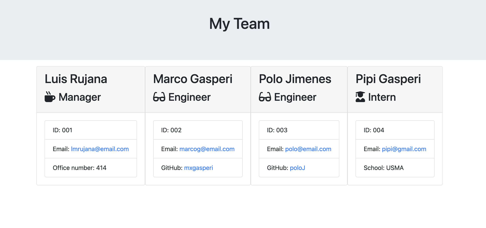

# Engineering Team Generator

  ## Table of Contents
  1. [Description](#description "Description")
  2. [Installation](#installation "Installation")
  3. [Usage](#usage "Usage")
  4. [License](#license "License")
  5. [Contribution](#contribution "Contributing")
  6. [Tests](#tests "Tests")
  7. [Questions](#questions "Questions")

  ## Description
  

  A CLI application that generates an HTML file with the basic information of an engineering team. It uses inquirer to promp questions about the team members and it allows to add any number of team members.

  Use the link below to watch a demo of the app in used:
  [YouTube](https://youtu.be/ce5cGRJ9YNs "Demo Video)

  Heres a screenshot of the final result, opened in the browser:
  

  ## Installation
  It needs inquirer, fs and path.

  ## Usage
  It's used by running node app.js on the terminal. The app will ask about the team members and their position in the team. The app finishes running when the user decides that they don't want to add more members; then a file named team.html is generated.

  ## License
  For more information on the license for this project, please click on the following link:
  [License](https://opensource.org/licenses/Apache-2.0)

  ## Contribution
  This app is a homework for the UM Coding Bootcamp. Parts of the code were provided and the rest was made by Luis Rujana.

  ## Tests
  As part of the homework, we needed to test that all the modules for the different clases were working. During development, all tests passed.

  ## Questions
  If you have any questions regarding this application, please contact me at:  
  [GitHub Page](https://github.com/lmrujana)  
  Email: lmrujanass@gmail.com
